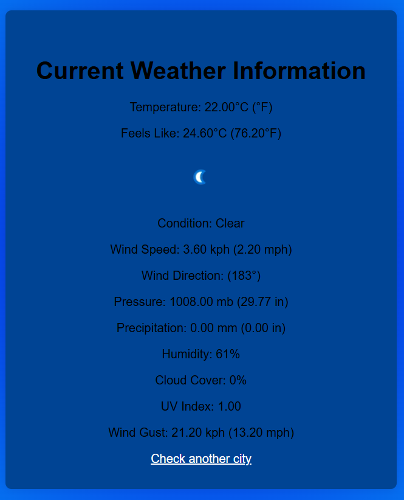

# WeatherApp 

The **WeatherApp** is a weather forecasting application that provides real-time weather information based on the user’s input location. It fetches weather data from a public weather API and displays it in a clean and user-friendly interface.

## How it Works
1. **User Input**: The user enters a city or location into the app.
2. **API Request**: Upon submission, the app sends a request to an external weather API (such as OpenWeatherMap) using JavaScript.
3. **Data Retrieval**: The API responds with current weather data in JSON format for the specified location.
4. **Displaying Information**: The app processes the API response and dynamically updates the UI with weather details like:
   - Temperature
   - Humidity
   - Wind speed
   - General weather conditions (sunny, cloudy, etc.)

## Technologies Used
- **HTML/CSS**: For structuring and styling the user interface.
- **JavaScript**: To handle API requests, data processing, and dynamic updates to the UI.
- **Weather API**: An external API service to retrieve real-time weather data.

## Key Features
- Real-time weather updates based on user input.
- Intuitive and minimalistic UI.
- Displays key weather metrics such as temperature, humidity, and wind speed.

## Screenshots

## Video
[Watch the video on YouTube](https://www.youtube.com/watch?v=rkxmVFZ9uRw)
